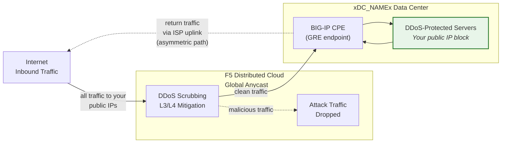
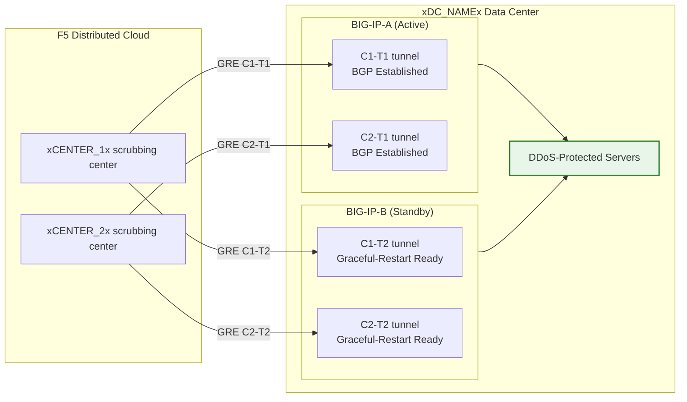

## Cloud GRE/BGP BIG-IP

- تكوين **أنفاق GRE** و**ربط BGP** من زوج BIG-IP HA
  (يعمل كمعدات مقر العميل، CPE)، مع أنفاق مستقلة
  لكل وحدة.
- الاتصال بمراكز تنقية **Cloud DDoS Mitigation**
  في **وضع التوجيه** (L3/L4).

## المتطلبات

- خدمة **L3/L4 Routed DDoS Mitigation** من Cloud
  (Always On أو Always Available) مُفعّلة لمستأجرك.
- BIG-IP مع:
    - LTM (أو وحدات الشبكات المكافئة).
    - **التوجيه الديناميكي (BGP)** مرخّص ومُفعّل.
- وضع التوجيه: على الأقل بادئة واحدة **معلنة علنياً /24 (أو أقصر)**
  للحماية (الحد الأدنى لـ IPv6 هو **/48**).
    - البادئات المحمية **يجب أن تكون قابلة للتوجيه العام** (ليست RFC 1918).
     نقاط نهاية GRE الخارجية يجب أن تكون أيضاً قابلة للتوجيه العام عندما تعبر الأنفاق
     الإنترنت العام؛ عمليات النشر التي تستخدم الاتصال الخاص
     (L2، الربط الخاص) يمكنها استخدام عناوين نقاط نهاية RFC 1918.
- الاتصال بين مركز البيانات/الموجه الخاص بك ومراكز
  تنقية Cloud.

## بنية التوافر العالي (HA)

يتم نشر BIG-IP كـ **زوج HA نشط/احتياطي**، حيث تحصل كل وحدة
على أنفاق GRE مستقلة وجلسات BGP خاصة بها إلى كل
مركز تنقية:

- **نقاط نهاية أنفاق مستقلة**: كل وحدة BIG-IP لديها عنوان IP ذاتي خارجي
  غير عائم (`traffic-group-local-only`) ومجموعتها
  الخاصة من أنفاق GRE. يستخدم BIG-IP-A عنوان `xBIGIP_A_OUTER_V4x` و
  يستخدم BIG-IP-B عنوان `xBIGIP_B_OUTER_V4x` كنقاط نهاية للأنفاق. هذا يتجنب
  الاعتماد على عنوان IP عائم لمصدر النفق.
- **جلسات BGP مستقلة**: كل وحدة تشغّل جلسات BGP الخاصة بها
  عبر أنفاقها الخاصة. BIG-IP-A يتصل بـ C1-T1 وC2-T1؛
  BIG-IP-B يتصل بـ C1-T2 وC2-T2. عند تجاوز الفشل تكون جلسات BGP
  للوحدة الاحتياطية مُنشأة بالفعل، لذا يمكن لـ
  Cloud تحويل حركة المرور فوراً.
- **مزامنة التكوين**: يتم مزامنة تكوينات الأنفاق وعناوين IP الذاتية والتوجيه
  بين الوحدات عبر **config-sync**. نظراً لأن تكوين BGP في `imish`
  خاص بكل وحدة، فإن كل وحدة تحتفظ ببيانات الجوار
  الخاصة بها. تحقق من أن المزامنة تشمل جميع كائنات tmsh.
- **سلوك BGP نشط/احتياطي**: الوحدة النشطة تُعلن عن
  البادئات المحمية بسمات BGP عادية. يمكن للوحدة الاحتياطية
  إما الإعلان عن نفس البادئات مع إضافة مسار AS أطول
  (مما يجعلها أقل تفضيلاً) أو إيقاف الإعلانات
  حتى حدوث تجاوز الفشل. قم بالتنسيق مع فريق SOC بشأن النهج المتبع.
- **تقارب تجاوز الفشل**: مع تفعيل `graceful-restart` والأنفاق
  المستقلة، فإن الوحدة النشطة الجديدة لديها بالفعل جلسات BGP
  مُنشأة. يعتمد التقارب على تحوّل اختيار أفضل مسار BGP
  إلى إعلانات الوحدة النشطة حديثاً. اختبر باستخدام
  `run sys failover standby`.

:::note
نموذج التوافر العالي بالأنفاق المستقلة المذكور أعلاه هو النهج الموصى به
لتكرار الأجهزة من جانب العميل. تحقق من تصميم تجاوز الفشل
الخاص بك مع فريق حسابك قبل الانتقال إلى
الإنتاج، خاصة فيما يتعلق باستراتيجية إضافة مسار AS وتوقيت
إعادة تقارب BGP.
:::
