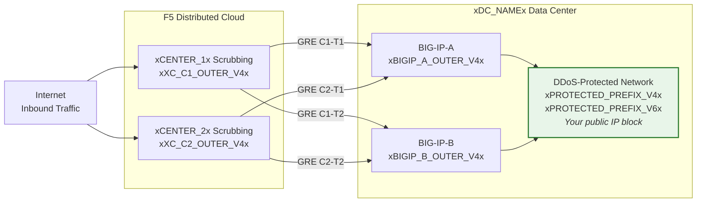
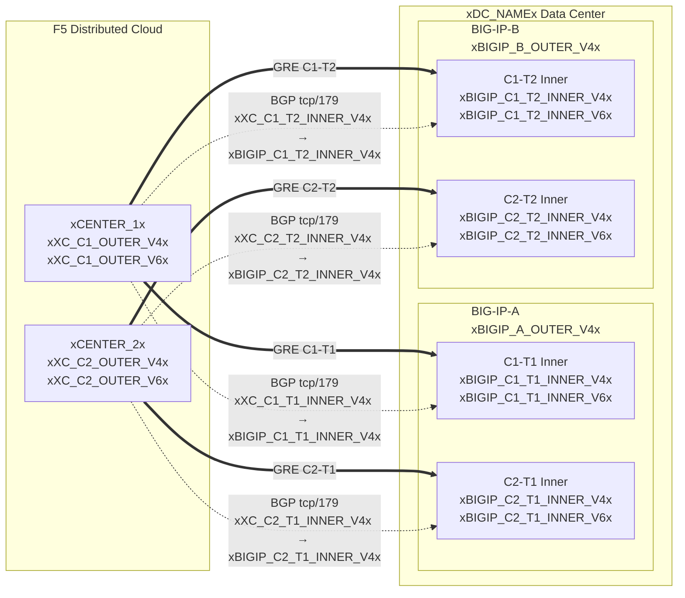

## الطوبولوجيا والعناوين

تكوين مركز البيانات **xDC_NAMEx**
للاتصال بمراكز التنقية السحابية.

:::note
**هذه قيم مثالية.** استبدلها بقيم خاصة بالعميل وقيم
مقدمة من مركز العمليات الأمنية (SOC) باستخدام الجداول أعلاه.

يجب أن تكون البادئات المحمية **قابلة للتوجيه علنياً** (غير RFC 1918).
يجب أيضاً أن تكون عناوين IP لنقاط نهاية GRE الخارجية قابلة للتوجيه علنياً عندما تمر الأنفاق
عبر الإنترنت العام؛ قد يسمح الاتصال الخاص (L2، التناظر الخاص)
بنقاط نهاية RFC 1918. راجع
[K000147949](https://my.f5.com/manage/s/article/K000147949) للاطلاع على أمثلة تستخدم عناوين توثيق صحيحة.

لتحقيق التكرار، أنشئ **نفقين لكل وحدة BIG-IP** إلى مراكز تنقية
موزعة جغرافياً مختلفة (4 أنفاق إجمالاً لزوج التوافر العالي HA).
:::

## أوراق العمل

استخدم أوراق عمل XC وBIG-IP التالية كمرجع عند بناء تكوين النفق.

### XC

**النفق C1-T1 — المركز 1 إلى BIG-IP-A:**

- عناوين IP الخارجية لـ GRE (لنقاط نهاية النفق):
    - IPv4 SRC: `xXC_C1_OUTER_V4x/24`
    - IPv4 DST: `xBIGIP_A_OUTER_V4x/24`
    - IPv6 SRC: `xXC_C1_OUTER_V6x/64`
    - IPv6 DST: `xBIGIP_A_OUTER_V6x/64`

- عناوين IP الداخلية لـ GRE (لجلسة BGP):
    - IPv4: `xXC_C1_T1_INNER_V4x/30`
    - IPv6: `xXC_C1_T1_INNER_V6x/64`

**النفق C1-T2 — المركز 1 إلى BIG-IP-B:**

- عناوين IP الخارجية لـ GRE (لنقاط نهاية النفق):
    - IPv4 SRC: `xXC_C1_OUTER_V4x/24`
    - IPv4 DST: `xBIGIP_B_OUTER_V4x/24`
    - IPv6 SRC: `xXC_C1_OUTER_V6x/64`
    - IPv6 DST: `xBIGIP_B_OUTER_V6x/64`

- عناوين IP الداخلية لـ GRE (لجلسة BGP):
    - IPv4: `xXC_C1_T2_INNER_V4x/30`
    - IPv6: `xXC_C1_T2_INNER_V6x/64`

**النفق C2-T1 — المركز 2 إلى BIG-IP-A:**

- عناوين IP الخارجية لـ GRE (لنقاط نهاية النفق):
    - IPv4 SRC: `xXC_C2_OUTER_V4x/24`
    - IPv4 DST: `xBIGIP_A_OUTER_V4x/24`
    - IPv6 SRC: `xXC_C2_OUTER_V6x/64`
    - IPv6 DST: `xBIGIP_A_OUTER_V6x/64`

- عناوين IP الداخلية لـ GRE (لجلسة BGP):
    - IPv4: `xXC_C2_T1_INNER_V4x/30`
    - IPv6: `xXC_C2_T1_INNER_V6x/64`

**النفق C2-T2 — المركز 2 إلى BIG-IP-B:**

- عناوين IP الخارجية لـ GRE (لنقاط نهاية النفق):
    - IPv4 SRC: `xXC_C2_OUTER_V4x/24`
    - IPv4 DST: `xBIGIP_B_OUTER_V4x/24`
    - IPv6 SRC: `xXC_C2_OUTER_V6x/64`
    - IPv6 DST: `xBIGIP_B_OUTER_V6x/64`

- عناوين IP الداخلية لـ GRE (لجلسة BGP):
    - IPv4: `xXC_C2_T2_INNER_V4x/30`
    - IPv6: `xXC_C2_T2_INNER_V6x/64`

:::note[عناوين IP الداخلية (العبور)]
تستخدم عناوين IP الداخلية مثل `10.10.10.0/30` عناوين RFC 1918. هذا
صحيح لأنها مغلفة داخل نفق GRE ولا تظهر أبداً
على الإنترنت العام. يجب أن تكون البادئات المحمية دائماً
قابلة للتوجيه علنياً؛ ويجب أن تكون عناوين IP لنقاط النهاية الخارجية قابلة للتوجيه علنياً عندما
تمر الأنفاق عبر الإنترنت العام.
:::

:::note[روابط IPv6 الداخلية]
تستخدم روابط IPv6 الداخلية بادئات /64 هنا لتتوافق مع الإعدادات الافتراضية الشائعة
للسحابة. بالنسبة للروابط من نقطة إلى نقطة، يُفضل استخدام /127 وفقاً لـ
[RFC 6164](https://datatracker.ietf.org/doc/html/rfc6164) لتجنب استنزاف اكتشاف الجوار. استخدم /127
إذا كان تعيين نفق مركز العمليات الأمنية (SOC) يدعم ذلك.
:::

### BIG-IP

**BIG-IP-A** (عنوان IP الخارجي `xBIGIP_A_OUTER_V4x` / `xBIGIP_A_OUTER_V6x`):

- عناوين IP الخارجية لـ GRE:
    - IPv4 SRC: `xBIGIP_A_OUTER_V4x/24`
    - IPv4 DST (المركز 1): `xXC_C1_OUTER_V4x/24`
    - IPv4 DST (المركز 2): `xXC_C2_OUTER_V4x/24`
    - IPv6 SRC: `xBIGIP_A_OUTER_V6x/64`
    - IPv6 DST (المركز 1): `xXC_C1_OUTER_V6x/64`
    - IPv6 DST (المركز 2): `xXC_C2_OUTER_V6x/64`

- عناوين IP الداخلية لـ GRE — النفق C1-T1:
    - IPv4: `xBIGIP_C1_T1_INNER_V4x/30`
    - IPv6: `xBIGIP_C1_T1_INNER_V6x/64`

- عناوين IP الداخلية لـ GRE — النفق C2-T1:
    - IPv4: `xBIGIP_C2_T1_INNER_V4x/30`
    - IPv6: `xBIGIP_C2_T1_INNER_V6x/64`

**BIG-IP-B** (عنوان IP الخارجي `xBIGIP_B_OUTER_V4x` / `xBIGIP_B_OUTER_V6x`):

- عناوين IP الخارجية لـ GRE:
    - IPv4 SRC: `xBIGIP_B_OUTER_V4x/24`
    - IPv4 DST (المركز 1): `xXC_C1_OUTER_V4x/24`
    - IPv4 DST (المركز 2): `xXC_C2_OUTER_V4x/24`
    - IPv6 SRC: `xBIGIP_B_OUTER_V6x/64`
    - IPv6 DST (المركز 1): `xXC_C1_OUTER_V6x/64`
    - IPv6 DST (المركز 2): `xXC_C2_OUTER_V6x/64`

- عناوين IP الداخلية لـ GRE — النفق C1-T2:
    - IPv4: `xBIGIP_C1_T2_INNER_V4x/30`
    - IPv6: `xBIGIP_C1_T2_INNER_V6x/64`

- عناوين IP الداخلية لـ GRE — النفق C2-T2:
    - IPv4: `xBIGIP_C2_T2_INNER_V4x/30`
    - IPv6: `xBIGIP_C2_T2_INNER_V6x/64`

- البادئات المحمية (المُعلنة للسحابة):
    - IPv4: `xPROTECTED_NET_V4xxPROTECTED_CIDR_V4x`
    - IPv6: `xPROTECTED_PREFIX_V6x`

### مخطط الطوبولوجيا التفصيلي

