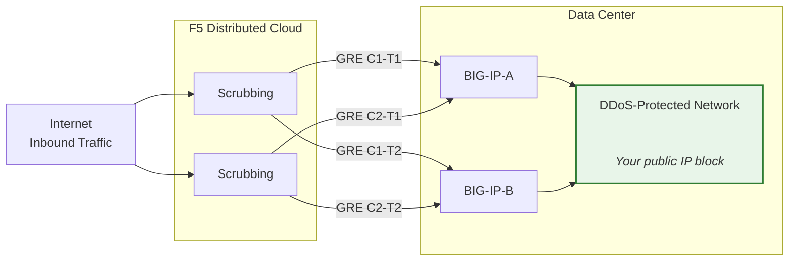
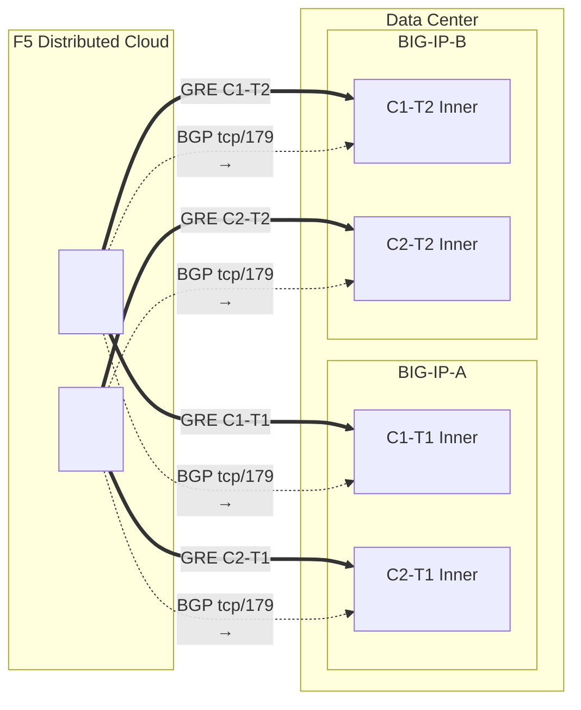

## Topology and addresses

Configuration for the **\<XCSH_DC_NAME>** data center
connecting to Cloud scrubbing centers.

:::note
**These are example values.** Replace with customer-specific and
SOC provided values using the tables above.

Protected prefixes **must be publicly routable** (non-RFC 1918).
GRE outer endpoint IPs must also be publicly routable when tunnels
traverse the public Internet; private connectivity (L2, private
peering) may allow RFC 1918 endpoints. See
[K000147949](https://my.f5.com/manage/s/article/K000147949) for examples using proper documentation
addresses.

For redundancy, create **2 tunnels per BIG-IP unit** to different
geo-located scrubbing centers (4 tunnels total for an HA pair).
:::

## Worksheets

Use the following XC and BIG-IP worksheets as reference when building the tunnel configuration.

### XC

**Tunnel C1-T1 — Center 1 to BIG-IP-A:**

- GRE outer IPs (for tunnel endpoints):
  - IPv4 SRC: `<XCSH_XC_C1_OUTER_V4>/24`
  - IPv4 DST: `<XCSH_BIGIP_A_OUTER_V4>/24`
  - IPv6 SRC: `<XCSH_XC_C1_OUTER_V6>/64`
  - IPv6 DST: `<XCSH_BIGIP_A_OUTER_V6>/64`

- GRE inner IPs (for BGP session):
  - IPv4: `<XCSH_XC_C1_T1_INNER_V4>/30`
  - IPv6: `<XCSH_XC_C1_T1_INNER_V6>/64`

**Tunnel C1-T2 — Center 1 to BIG-IP-B:**

- GRE outer IPs (for tunnel endpoints):
  - IPv4 SRC: `<XCSH_XC_C1_OUTER_V4>/24`
  - IPv4 DST: `<XCSH_BIGIP_B_OUTER_V4>/24`
  - IPv6 SRC: `<XCSH_XC_C1_OUTER_V6>/64`
  - IPv6 DST: `<XCSH_BIGIP_B_OUTER_V6>/64`

- GRE inner IPs (for BGP session):
  - IPv4: `<XCSH_XC_C1_T2_INNER_V4>/30`
  - IPv6: `<XCSH_XC_C1_T2_INNER_V6>/64`

**Tunnel C2-T1 — Center 2 to BIG-IP-A:**

- GRE outer IPs (for tunnel endpoints):
  - IPv4 SRC: `<XCSH_XC_C2_OUTER_V4>/24`
  - IPv4 DST: `<XCSH_BIGIP_A_OUTER_V4>/24`
  - IPv6 SRC: `<XCSH_XC_C2_OUTER_V6>/64`
  - IPv6 DST: `<XCSH_BIGIP_A_OUTER_V6>/64`

- GRE inner IPs (for BGP session):
  - IPv4: `<XCSH_XC_C2_T1_INNER_V4>/30`
  - IPv6: `<XCSH_XC_C2_T1_INNER_V6>/64`

**Tunnel C2-T2 — Center 2 to BIG-IP-B:**

- GRE outer IPs (for tunnel endpoints):
  - IPv4 SRC: `<XCSH_XC_C2_OUTER_V4>/24`
  - IPv4 DST: `<XCSH_BIGIP_B_OUTER_V4>/24`
  - IPv6 SRC: `<XCSH_XC_C2_OUTER_V6>/64`
  - IPv6 DST: `<XCSH_BIGIP_B_OUTER_V6>/64`

- GRE inner IPs (for BGP session):
  - IPv4: `<XCSH_XC_C2_T2_INNER_V4>/30`
  - IPv6: `<XCSH_XC_C2_T2_INNER_V6>/64`

:::note[Inner (transit) IPs]
Inner IPs such as `10.10.10.0/30` use RFC 1918 addresses. This is
correct because they are encapsulated inside the GRE tunnel and never
appear on the public Internet. Protected prefixes must always be
publicly routable; outer endpoint IPs must be publicly routable when
tunnels traverse the public Internet.
:::

:::note[IPv6 inner links]
IPv6 inner links use /64 prefixes here to match common
Cloud defaults. For point-to-point links, /127 is preferred per
[RFC 6164](https://datatracker.ietf.org/doc/html/rfc6164) to avoid neighbor-discovery exhaustion. Use /127
if the SOC tunnel assignment supports it.
:::

### BIG-IP

**BIG-IP-A** (outer IP `<XCSH_BIGIP_A_OUTER_V4>` / `<XCSH_BIGIP_A_OUTER_V6>`):

- GRE outer IPs:
  - IPv4 SRC: `<XCSH_BIGIP_A_OUTER_V4>/24`
  - IPv4 DST (Center 1): `<XCSH_XC_C1_OUTER_V4>/24`
  - IPv4 DST (Center 2): `<XCSH_XC_C2_OUTER_V4>/24`
  - IPv6 SRC: `<XCSH_BIGIP_A_OUTER_V6>/64`
  - IPv6 DST (Center 1): `<XCSH_XC_C1_OUTER_V6>/64`
  - IPv6 DST (Center 2): `<XCSH_XC_C2_OUTER_V6>/64`

- GRE inner IPs — Tunnel C1-T1:
  - IPv4: `<XCSH_BIGIP_C1_T1_INNER_V4>/30`
  - IPv6: `<XCSH_BIGIP_C1_T1_INNER_V6>/64`

- GRE inner IPs — Tunnel C2-T1:
  - IPv4: `<XCSH_BIGIP_C2_T1_INNER_V4>/30`
  - IPv6: `<XCSH_BIGIP_C2_T1_INNER_V6>/64`

**BIG-IP-B** (outer IP `<XCSH_BIGIP_B_OUTER_V4>` / `<XCSH_BIGIP_B_OUTER_V6>`):

- GRE outer IPs:
  - IPv4 SRC: `<XCSH_BIGIP_B_OUTER_V4>/24`
  - IPv4 DST (Center 1): `<XCSH_XC_C1_OUTER_V4>/24`
  - IPv4 DST (Center 2): `<XCSH_XC_C2_OUTER_V4>/24`
  - IPv6 SRC: `<XCSH_BIGIP_B_OUTER_V6>/64`
  - IPv6 DST (Center 1): `<XCSH_XC_C1_OUTER_V6>/64`
  - IPv6 DST (Center 2): `<XCSH_XC_C2_OUTER_V6>/64`

- GRE inner IPs — Tunnel C1-T2:
  - IPv4: `<XCSH_BIGIP_C1_T2_INNER_V4>/30`
  - IPv6: `<XCSH_BIGIP_C1_T2_INNER_V6>/64`

- GRE inner IPs — Tunnel C2-T2:
  - IPv4: `<XCSH_BIGIP_C2_T2_INNER_V4>/30`
  - IPv6: `<XCSH_BIGIP_C2_T2_INNER_V6>/64`

- Protected prefixes (advertised to Cloud):
  - IPv4: `<XCSH_PROTECTED_NET_V4><XCSH_PROTECTED_CIDR_V4>`
  - IPv6: `<XCSH_PROTECTED_PREFIX_V6>`

### Detailed topology diagram

