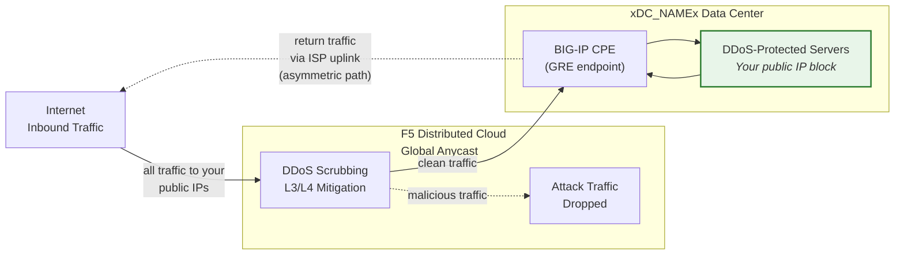
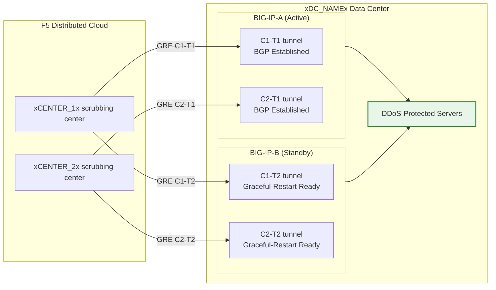

## Cloud GRE/BGP BIG-IP

- Configure **túneles GRE** y **peering BGP** desde un par HA de BIG-IP
  (actuando como equipo en las instalaciones del cliente, CPE), con túneles
  independientes por unidad.
- Conéctese a los centros de depuración de **Cloud DDoS Mitigation**
  en **modo enrutado** (L3/L4).

## Requisitos

- Servicio de **Mitigación DDoS enrutada L3/L4** de Cloud
  (Always On o Always Available) habilitado para su tenant.
- BIG-IP con:
    - LTM (o módulos de red equivalentes).
    - **Enrutamiento dinámico (BGP)** licenciado y habilitado.
- Modo enrutado: al menos un prefijo **/24 (o más corto) anunciado públicamente**
  para protección (el mínimo para IPv6 es **/48**).
    - Los prefijos protegidos **deben ser enrutables públicamente** (no RFC 1918).
     Los endpoints externos de GRE también deben ser enrutables públicamente cuando los túneles
     atraviesan la Internet pública; las implementaciones que utilizan conectividad
     privada (L2, peering privado) pueden usar direcciones de endpoint
     RFC 1918.
- Conectividad entre su centro de datos/router y el(los)
  centro(s) de depuración Cloud.

## Arquitectura HA

El BIG-IP se implementa como un **par HA activo/standby**, cada unidad
obtiene sus propios túneles GRE independientes y sesiones BGP hacia cada
centro de depuración:

- **Endpoints de túnel independientes**: Cada unidad BIG-IP tiene su propia
  IP externa no flotante (`traffic-group-local-only`) y su
  propio conjunto de túneles GRE. BIG-IP-A utiliza `xBIGIP_A_OUTER_V4x` y
  BIG-IP-B utiliza `xBIGIP_B_OUTER_V4x` como endpoints de túnel. Esto evita
  la dependencia de una IP flotante para el origen de los túneles.
- **Sesiones BGP independientes**: Cada unidad ejecuta sus propias sesiones BGP
  sobre sus propios túneles. BIG-IP-A establece peering con C1-T1 y C2-T1;
  BIG-IP-B establece peering con C1-T2 y C2-T2. Durante un failover, las sesiones
  BGP de la unidad en standby ya están establecidas, por lo que
  Cloud puede redirigir el tráfico de inmediato.
- **Sincronización de configuración**: Las configuraciones de túneles, self IP y enrutamiento se
  sincronizan entre unidades mediante **config-sync**. Dado que la
  configuración BGP de `imish` es por unidad, cada unidad mantiene sus propias
  declaraciones de vecinos. Verifique que la sincronización incluya todos los objetos tmsh.
- **Comportamiento BGP activo/standby**: La unidad activa anuncia
  los prefijos protegidos con atributos BGP normales. La unidad en standby
  puede anunciar los mismos prefijos con un AS-path prepend más largo
  (haciéndola menos preferida) o suprimir los anuncios
  hasta el failover. Coordine el enfoque con el SOC.
- **Convergencia en failover**: Con `graceful-restart` habilitado y
  túneles independientes, la nueva unidad activa ya tiene sesiones
  BGP establecidas. La convergencia depende de que la selección de mejor ruta BGP
  cambie hacia los anuncios de la unidad recién activa. Pruebe con
  `run sys failover standby`.

:::note
El modelo HA con túneles independientes descrito anteriormente es el enfoque recomendado
para la redundancia de dispositivos del lado del cliente. Valide su diseño
específico de failover con su equipo de cuenta antes de pasar a
producción, particularmente en lo que respecta a la estrategia de AS-path prepend y
los tiempos de reconvergencia BGP.
:::
