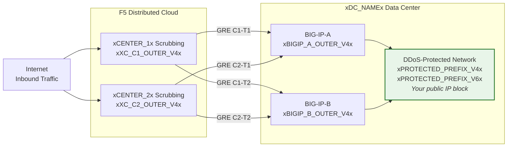
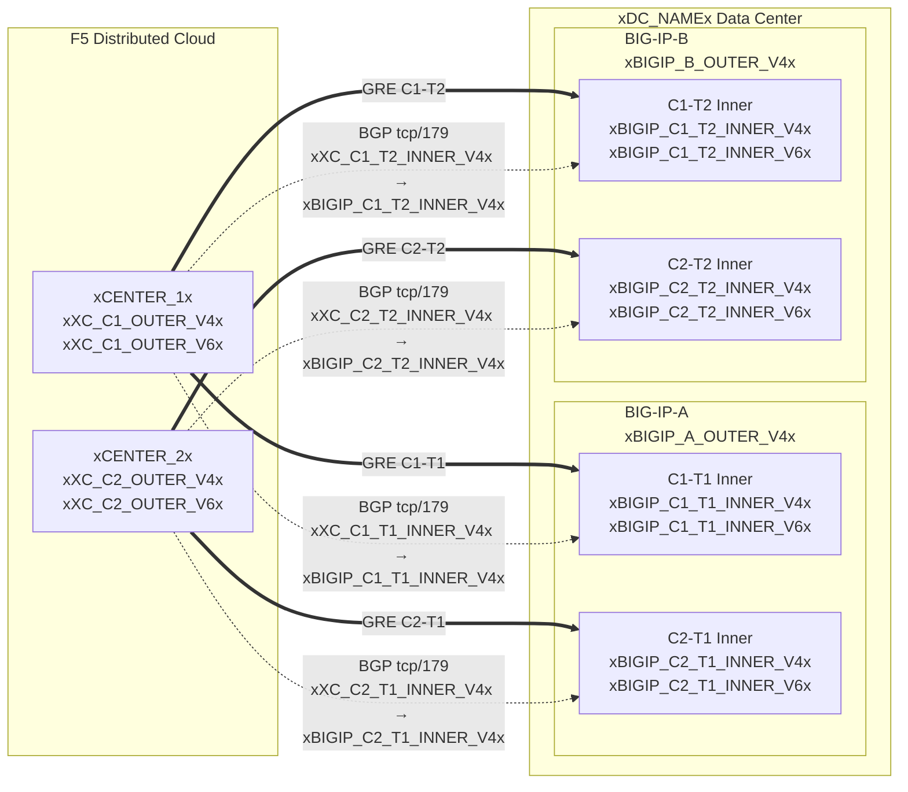

## Topologie et adresses

Configuration pour le centre de données **xDC_NAMEx**
se connectant aux centres de nettoyage Cloud.

:::note
**Ce sont des valeurs d'exemple.** Remplacez-les par les valeurs spécifiques au client et
fournies par le SOC en utilisant les tableaux ci-dessus.

Les préfixes protégés **doivent être publiquement routables** (non-RFC 1918).
Les adresses IP des extrémités externes GRE doivent également être publiquement routables lorsque les tunnels
traversent l'Internet public ; la connectivité privée (L2, peering
privé) peut permettre l'utilisation d'extrémités RFC 1918. Voir
[K000147949](https://my.f5.com/manage/s/article/K000147949) pour des exemples utilisant des adresses
de documentation appropriées.

Pour la redondance, créez **2 tunnels par unité BIG-IP** vers différents
centres de nettoyage géo-distribués (4 tunnels au total pour une paire HA).
:::

## Fiches de travail

Utilisez les fiches de travail XC et BIG-IP suivantes comme référence lors de la construction de la configuration des tunnels.

### XC

**Tunnel C1-T1 — Centre 1 vers BIG-IP-A :**

- IPs externes GRE (pour les extrémités de tunnel) :
    - IPv4 SRC : `xXC_C1_OUTER_V4x/24`
    - IPv4 DST : `xBIGIP_A_OUTER_V4x/24`
    - IPv6 SRC : `xXC_C1_OUTER_V6x/64`
    - IPv6 DST : `xBIGIP_A_OUTER_V6x/64`

- IPs internes GRE (pour la session BGP) :
    - IPv4 : `xXC_C1_T1_INNER_V4x/30`
    - IPv6 : `xXC_C1_T1_INNER_V6x/64`

**Tunnel C1-T2 — Centre 1 vers BIG-IP-B :**

- IPs externes GRE (pour les extrémités de tunnel) :
    - IPv4 SRC : `xXC_C1_OUTER_V4x/24`
    - IPv4 DST : `xBIGIP_B_OUTER_V4x/24`
    - IPv6 SRC : `xXC_C1_OUTER_V6x/64`
    - IPv6 DST : `xBIGIP_B_OUTER_V6x/64`

- IPs internes GRE (pour la session BGP) :
    - IPv4 : `xXC_C1_T2_INNER_V4x/30`
    - IPv6 : `xXC_C1_T2_INNER_V6x/64`

**Tunnel C2-T1 — Centre 2 vers BIG-IP-A :**

- IPs externes GRE (pour les extrémités de tunnel) :
    - IPv4 SRC : `xXC_C2_OUTER_V4x/24`
    - IPv4 DST : `xBIGIP_A_OUTER_V4x/24`
    - IPv6 SRC : `xXC_C2_OUTER_V6x/64`
    - IPv6 DST : `xBIGIP_A_OUTER_V6x/64`

- IPs internes GRE (pour la session BGP) :
    - IPv4 : `xXC_C2_T1_INNER_V4x/30`
    - IPv6 : `xXC_C2_T1_INNER_V6x/64`

**Tunnel C2-T2 — Centre 2 vers BIG-IP-B :**

- IPs externes GRE (pour les extrémités de tunnel) :
    - IPv4 SRC : `xXC_C2_OUTER_V4x/24`
    - IPv4 DST : `xBIGIP_B_OUTER_V4x/24`
    - IPv6 SRC : `xXC_C2_OUTER_V6x/64`
    - IPv6 DST : `xBIGIP_B_OUTER_V6x/64`

- IPs internes GRE (pour la session BGP) :
    - IPv4 : `xXC_C2_T2_INNER_V4x/30`
    - IPv6 : `xXC_C2_T2_INNER_V6x/64`

:::note[IPs internes (transit)]
Les IPs internes telles que `10.10.10.0/30` utilisent des adresses RFC 1918. Cela est
correct car elles sont encapsulées à l'intérieur du tunnel GRE et n'apparaissent jamais
sur l'Internet public. Les préfixes protégés doivent toujours être
publiquement routables ; les IPs des extrémités externes doivent être publiquement routables lorsque
les tunnels traversent l'Internet public.
:::

:::note[Liens internes IPv6]
Les liens internes IPv6 utilisent ici des préfixes /64 pour correspondre aux
valeurs par défaut courantes du Cloud. Pour les liens point à point, /127 est préféré selon la
[RFC 6164](https://datatracker.ietf.org/doc/html/rfc6164) afin d'éviter l'épuisement de la découverte de voisins. Utilisez /127
si l'attribution de tunnel du SOC le permet.
:::

### BIG-IP

**BIG-IP-A** (IP externe `xBIGIP_A_OUTER_V4x` / `xBIGIP_A_OUTER_V6x`) :

- IPs externes GRE :
    - IPv4 SRC : `xBIGIP_A_OUTER_V4x/24`
    - IPv4 DST (Centre 1) : `xXC_C1_OUTER_V4x/24`
    - IPv4 DST (Centre 2) : `xXC_C2_OUTER_V4x/24`
    - IPv6 SRC : `xBIGIP_A_OUTER_V6x/64`
    - IPv6 DST (Centre 1) : `xXC_C1_OUTER_V6x/64`
    - IPv6 DST (Centre 2) : `xXC_C2_OUTER_V6x/64`

- IPs internes GRE — Tunnel C1-T1 :
    - IPv4 : `xBIGIP_C1_T1_INNER_V4x/30`
    - IPv6 : `xBIGIP_C1_T1_INNER_V6x/64`

- IPs internes GRE — Tunnel C2-T1 :
    - IPv4 : `xBIGIP_C2_T1_INNER_V4x/30`
    - IPv6 : `xBIGIP_C2_T1_INNER_V6x/64`

**BIG-IP-B** (IP externe `xBIGIP_B_OUTER_V4x` / `xBIGIP_B_OUTER_V6x`) :

- IPs externes GRE :
    - IPv4 SRC : `xBIGIP_B_OUTER_V4x/24`
    - IPv4 DST (Centre 1) : `xXC_C1_OUTER_V4x/24`
    - IPv4 DST (Centre 2) : `xXC_C2_OUTER_V4x/24`
    - IPv6 SRC : `xBIGIP_B_OUTER_V6x/64`
    - IPv6 DST (Centre 1) : `xXC_C1_OUTER_V6x/64`
    - IPv6 DST (Centre 2) : `xXC_C2_OUTER_V6x/64`

- IPs internes GRE — Tunnel C1-T2 :
    - IPv4 : `xBIGIP_C1_T2_INNER_V4x/30`
    - IPv6 : `xBIGIP_C1_T2_INNER_V6x/64`

- IPs internes GRE — Tunnel C2-T2 :
    - IPv4 : `xBIGIP_C2_T2_INNER_V4x/30`
    - IPv6 : `xBIGIP_C2_T2_INNER_V6x/64`

- Préfixes protégés (annoncés au Cloud) :
    - IPv4 : `xPROTECTED_NET_V4xxPROTECTED_CIDR_V4x`
    - IPv6 : `xPROTECTED_PREFIX_V6x`

### Diagramme de topologie détaillé

