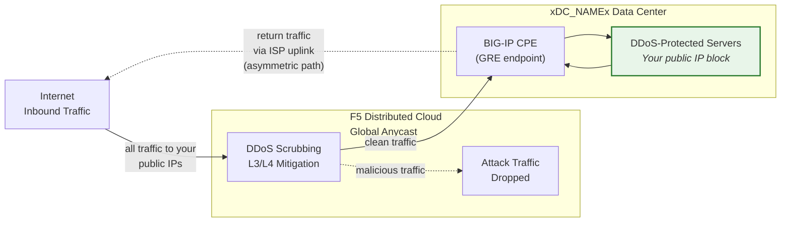
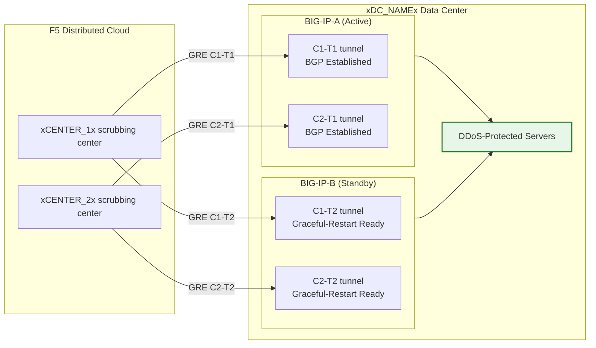

## Cloud GRE/BGP BIG-IP

- एक BIG-IP HA जोड़ी (ग्राहक परिसर उपकरण, CPE के रूप में कार्य करते हुए) से **GRE टनल** और **BGP पीयरिंग** कॉन्फ़िगर करें, प्रत्येक इकाई के लिए स्वतंत्र टनल के साथ।
- **Cloud DDoS Mitigation** स्क्रबिंग केंद्रों से **राउटेड मोड** (L3/L4) में कनेक्ट करें।

## आवश्यकताएँ

- आपके टेनेंट के लिए Cloud **L3/L4 Routed DDoS Mitigation** सेवा (Always On या Always Available) सक्षम।
- BIG-IP जिसमें:
    - LTM (या समकक्ष नेटवर्किंग मॉड्यूल)।
    - **डायनामिक राउटिंग (BGP)** लाइसेंस प्राप्त और सक्षम।
- राउटेड मोड: सुरक्षा के लिए कम से कम एक **सार्वजनिक रूप से विज्ञापित /24 (या छोटा)** प्रीफ़िक्स (IPv6 न्यूनतम **/48** है)।
    - संरक्षित प्रीफ़िक्स **सार्वजनिक रूप से राउटेबल होने चाहिए** (गैर-RFC 1918)। जब टनल सार्वजनिक इंटरनेट से गुजरती हैं तो GRE बाहरी एंडपॉइंट भी सार्वजनिक रूप से राउटेबल होने चाहिए; निजी कनेक्टिविटी (L2, प्राइवेट पीयरिंग) का उपयोग करने वाले डिप्लॉयमेंट RFC 1918 एंडपॉइंट पते का उपयोग कर सकते हैं।
- आपके डेटा सेंटर/राउटर और Cloud स्क्रबिंग केंद्र(ओं) के बीच कनेक्टिविटी।

## HA आर्किटेक्चर

BIG-IP को **एक्टिव/स्टैंडबाय HA जोड़ी** के रूप में डिप्लॉय किया जाता है, प्रत्येक इकाई को हर स्क्रबिंग केंद्र के लिए अपनी स्वतंत्र GRE टनल और BGP सत्र मिलते हैं:

- **स्वतंत्र टनल एंडपॉइंट**: प्रत्येक BIG-IP इकाई का अपना गैर-फ्लोटिंग बाहरी सेल्फ IP (`traffic-group-local-only`) और अपना GRE टनल सेट होता है। BIG-IP-A `xBIGIP_A_OUTER_V4x` का उपयोग करता है और BIG-IP-B `xBIGIP_B_OUTER_V4x` का टनल एंडपॉइंट के रूप में उपयोग करता है। यह टनल सोर्सिंग के लिए फ्लोटिंग IP पर निर्भरता से बचाता है।
- **स्वतंत्र BGP सत्र**: प्रत्येक इकाई अपनी टनल पर अपने BGP सत्र चलाती है। BIG-IP-A C1-T1 और C2-T1 के साथ पीयर करता है; BIG-IP-B C1-T2 और C2-T2 के साथ पीयर करता है। फेलओवर पर स्टैंडबाय इकाई के BGP सत्र पहले से स्थापित होते हैं, इसलिए Cloud तुरंत ट्रैफ़िक स्थानांतरित कर सकता है।
- **कॉन्फ़िग सिंक**: टनल, सेल्फ IP, और राउटिंग कॉन्फ़िगरेशन **config-sync** के माध्यम से इकाइयों के बीच सिंक होते हैं। चूँकि `imish` BGP कॉन्फ़िगरेशन प्रति-इकाई है, प्रत्येक इकाई अपने स्वयं के नेबर स्टेटमेंट बनाए रखती है। सत्यापित करें कि सिंक में सभी tmsh ऑब्जेक्ट शामिल हैं।
- **एक्टिव/स्टैंडबाय BGP व्यवहार**: एक्टिव इकाई सामान्य BGP एट्रिब्यूट के साथ संरक्षित प्रीफ़िक्स का विज्ञापन करती है। स्टैंडबाय इकाई या तो लंबे AS-path प्रीपेंड (इसे कम पसंदीदा बनाते हुए) के साथ समान प्रीफ़िक्स का विज्ञापन कर सकती है या फेलओवर तक विज्ञापन दबा सकती है। दृष्टिकोण के लिए SOC के साथ समन्वय करें।
- **फेलओवर कन्वर्जेंस**: `graceful-restart` सक्षम और स्वतंत्र टनल के साथ, नई एक्टिव इकाई के पास पहले से स्थापित BGP सत्र होते हैं। कन्वर्जेंस नई एक्टिव इकाई के विज्ञापनों की ओर BGP बेस्ट-पाथ चयन शिफ्ट होने पर निर्भर करता है। `run sys failover standby` के साथ परीक्षण करें।

:::note
ऊपर दिया गया स्वतंत्र-टनल HA मॉडल ग्राहक-पक्ष डिवाइस रिडंडेंसी के लिए अनुशंसित दृष्टिकोण है। प्रोडक्शन में जाने से पहले अपने विशिष्ट फेलओवर डिज़ाइन को अपनी अकाउंट टीम के साथ मान्य करें, विशेष रूप से AS-path प्रीपेंड रणनीति और BGP रीकन्वर्जेंस टाइमिंग के संबंध में।
:::
