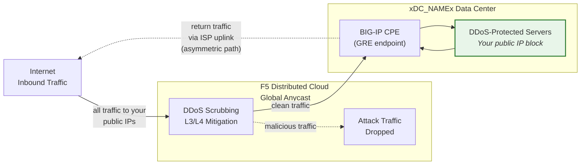
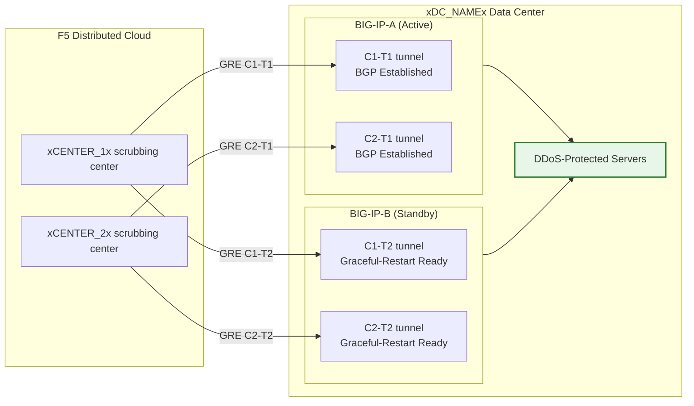

## Cloud GRE/BGP BIG-IP

- 독립적인 유닛별 터널을 사용하여 BIG-IP HA 쌍(고객 구내 장비, CPE 역할)에서 **GRE 터널** 및 **BGP 피어링**을 구성합니다.
- **라우티드 모드**(L3/L4)로 **Cloud DDoS Mitigation** 스크러빙 센터에 연결합니다.

## 요구 사항

- 테넌트에 Cloud **L3/L4 라우티드 DDoS Mitigation** 서비스(Always On 또는 Always Available)가 활성화되어 있어야 합니다.
- BIG-IP 요구 사항:
    - LTM(또는 동등한 네트워킹 모듈).
    - **동적 라우팅(BGP)** 라이선스 및 활성화.
- 라우티드 모드: 보호를 위해 최소 하나의 **공개적으로 광고된 /24(또는 더 짧은)** 프리픽스 필요(IPv6 최소값은 **/48**).
    - 보호 프리픽스는 **공개적으로 라우팅 가능**해야 합니다(비-RFC 1918). 터널이 공용 인터넷을 통과하는 경우 GRE 외부 엔드포인트도 공개적으로 라우팅 가능해야 합니다. 프라이빗 연결(L2, 프라이빗 피어링)을 사용하는 배포에서는 RFC 1918 엔드포인트 주소를 사용할 수 있습니다.
- 데이터센터/라우터와 Cloud 스크러빙 센터 간의 연결.

## HA 아키텍처

BIG-IP는 **액티브/스탠바이 HA 쌍**으로 배포되며, 각 유닛은 모든 스크러빙 센터에 대해 독립적인 GRE 터널과 BGP 세션을 갖습니다:

- **독립적인 터널 엔드포인트**: 각 BIG-IP 유닛은 자체 비-플로팅 외부 셀프 IP(`traffic-group-local-only`)와 자체 GRE 터널 세트를 갖습니다. BIG-IP-A는 `xBIGIP_A_OUTER_V4x`를, BIG-IP-B는 `xBIGIP_B_OUTER_V4x`를 터널 엔드포인트로 사용합니다. 이를 통해 터널 소싱을 위한 플로팅 IP 의존성을 방지합니다.
- **독립적인 BGP 세션**: 각 유닛은 자체 터널을 통해 자체 BGP 세션을 실행합니다. BIG-IP-A는 C1-T1 및 C2-T1과 피어링하고, BIG-IP-B는 C1-T2 및 C2-T2와 피어링합니다. 페일오버 시 스탠바이 유닛의 BGP 세션이 이미 설정되어 있으므로 Cloud가 즉시 트래픽을 전환할 수 있습니다.
- **Config sync**: 터널, 셀프 IP 및 라우팅 구성은 **config-sync**를 통해 유닛 간에 동기화됩니다. `imish` BGP 구성은 유닛별이므로 각 유닛은 자체 neighbor 문을 유지합니다. 동기화에 모든 tmsh 객체가 포함되는지 확인하십시오.
- **액티브/스탠바이 BGP 동작**: 액티브 유닛은 정상적인 BGP 속성으로 보호 프리픽스를 광고합니다. 스탠바이 유닛은 더 긴 AS-path prepend로 동일한 프리픽스를 광고하거나(덜 선호되도록) 페일오버까지 광고를 억제할 수 있습니다. SOC와 접근 방식을 조율하십시오.
- **페일오버 수렴**: `graceful-restart`가 활성화되고 독립적인 터널이 있는 경우, 새로운 액티브 유닛은 이미 설정된 BGP 세션을 갖습니다. 수렴은 BGP 최적 경로 선택이 새로 활성화된 유닛의 광고로 전환되는 것에 따라 달라집니다. `run sys failover standby`로 테스트하십시오.

:::note
위의 독립 터널 HA 모델은 고객 측 장치 이중화를 위한 권장 접근 방식입니다. 프로덕션에 투입하기 전에, 특히 AS-path prepend 전략 및 BGP 재수렴 타이밍과 관련하여 특정 페일오버 설계를 계정 팀과 검증하십시오.
:::
