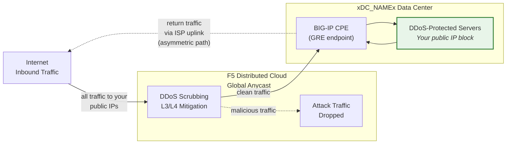
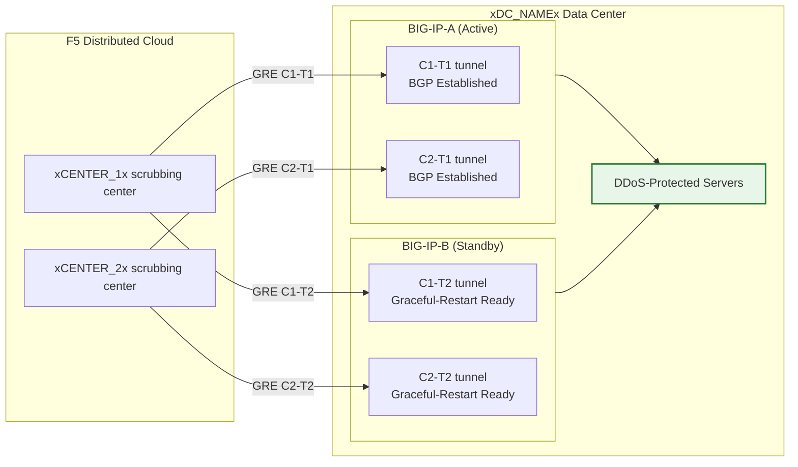

## Cloud GRE/BGP BIG-IP

- กำหนดค่า **GRE tunnels** และ **BGP peering** จาก BIG-IP HA pair
  (ทำหน้าที่เป็นอุปกรณ์ฝั่งลูกค้า, CPE) โดยมี tunnel อิสระต่อแต่ละหน่วย
- เชื่อมต่อกับศูนย์ scrubbing ของ **Cloud DDoS Mitigation**
  ใน **routed mode** (L3/L4)

## ข้อกำหนด

- บริการ Cloud **L3/L4 Routed DDoS Mitigation**
  (Always On หรือ Always Available) เปิดใช้งานสำหรับ tenant ของคุณ
- BIG-IP ที่มี:
    - LTM (หรือโมดูลเครือข่ายเทียบเท่า)
    - **Dynamic routing (BGP)** ได้รับอนุญาตและเปิดใช้งาน
- Routed mode: อย่างน้อยหนึ่ง **publicly advertised /24 (หรือสั้นกว่า)**
  prefix สำหรับการป้องกัน (IPv6 ขั้นต่ำคือ **/48**)
    - prefix ที่ได้รับการป้องกัน **ต้องสามารถ route ได้แบบสาธารณะ** (ไม่ใช่ RFC 1918)
     GRE outer endpoints ต้องสามารถ route ได้แบบสาธารณะเช่นกันเมื่อ tunnels
     ผ่านอินเทอร์เน็ตสาธารณะ; การ deploy ที่ใช้การเชื่อมต่อแบบส่วนตัว
     (L2, private peering) สามารถใช้ที่อยู่ endpoint แบบ RFC 1918 ได้
- การเชื่อมต่อระหว่าง data center/router ของคุณกับ
  ศูนย์ scrubbing ของ Cloud

## สถาปัตยกรรม HA

BIG-IP ถูก deploy เป็น **active/standby HA pair** โดยแต่ละหน่วย
จะมี GRE tunnels และ BGP sessions อิสระของตัวเองไปยังทุกศูนย์ scrubbing:

- **Tunnel endpoints อิสระ**: BIG-IP แต่ละหน่วยมี
  non-floating outer self IP (`traffic-group-local-only`) ของตัวเองและ
  ชุด GRE tunnels ของตัวเอง BIG-IP-A ใช้ `xBIGIP_A_OUTER_V4x` และ
  BIG-IP-B ใช้ `xBIGIP_B_OUTER_V4x` เป็น tunnel endpoints ซึ่งหลีกเลี่ยง
  การพึ่งพา floating IP สำหรับ tunnel sourcing
- **BGP sessions อิสระ**: แต่ละหน่วยรัน BGP sessions ของตัวเอง
  ผ่าน tunnels ของตัวเอง BIG-IP-A peer กับ C1-T1 และ C2-T1;
  BIG-IP-B peer กับ C1-T2 และ C2-T2 เมื่อเกิด failover BGP sessions ของหน่วย standby
  จะ established อยู่แล้ว ดังนั้น Cloud สามารถเปลี่ยนเส้นทาง traffic ได้ทันที
- **Config sync**: การกำหนดค่า Tunnel, self IP และ routing จะถูก
  sync ระหว่างหน่วยผ่าน **config-sync** เนื่องจากการกำหนดค่า BGP ใน `imish`
  เป็นแบบต่อหน่วย แต่ละหน่วยจึงดูแล neighbor statements ของตัวเอง
  ตรวจสอบว่า sync รวม tmsh objects ทั้งหมด
- **พฤติกรรม BGP แบบ Active/standby**: หน่วย active จะ advertise
  protected prefixes ด้วย BGP attributes ปกติ หน่วย standby
  สามารถ advertise prefixes เดียวกันด้วย AS-path prepend ที่ยาวกว่า
  (ทำให้ถูกเลือกน้อยกว่า) หรือระงับ advertisements
  จนกว่าจะเกิด failover ประสานแนวทางกับ SOC
- **Failover convergence**: เมื่อเปิดใช้งาน `graceful-restart` และ
  tunnels อิสระ หน่วย active ใหม่จะมี BGP sessions ที่ established อยู่แล้ว
  Convergence ขึ้นอยู่กับการเลือก BGP best-path ที่เปลี่ยนไปยัง
  advertisements ของหน่วย active ใหม่ ทดสอบด้วย
  `run sys failover standby`

:::note
โมเดล HA แบบ independent-tunnel ข้างต้นเป็นแนวทางที่แนะนำ
สำหรับการทำ redundancy อุปกรณ์ฝั่งลูกค้า ตรวจสอบความถูกต้องของการออกแบบ
failover เฉพาะของคุณกับทีมบัญชีก่อนนำไปใช้งานจริง
โดยเฉพาะอย่างยิ่งเกี่ยวกับกลยุทธ์ AS-path prepend และ
ระยะเวลา BGP reconvergence
:::
